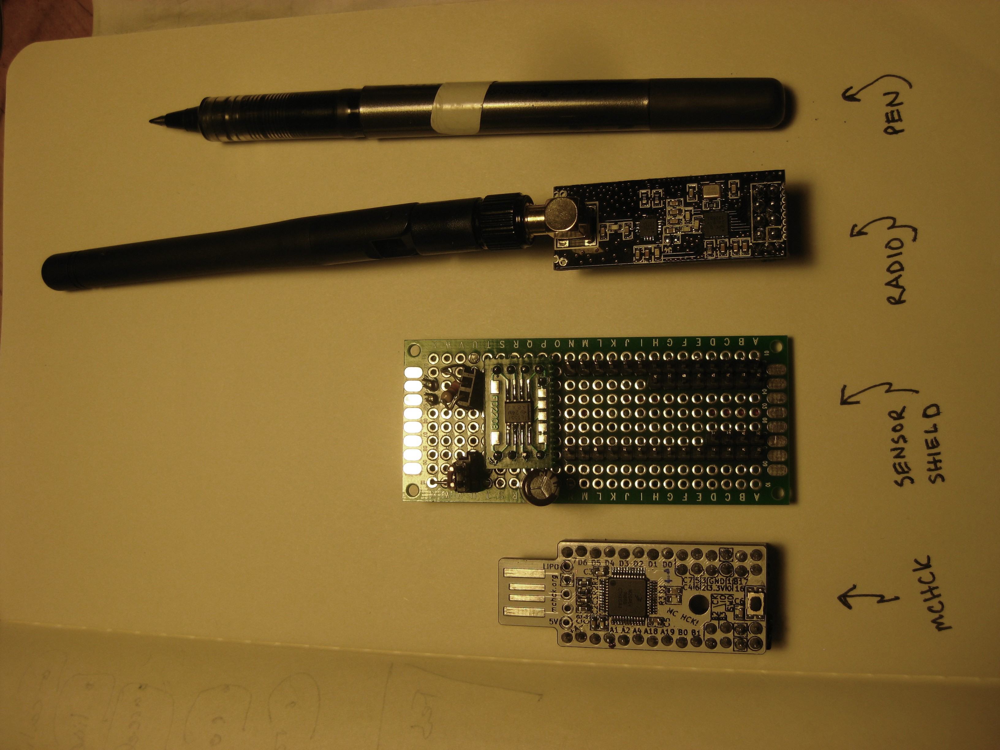

# Riffle -- Design Philosophy

- design philosophy
the bottle -- deployment, 'detrivore' philosophy
the sd card -- data
protoboard -- folks can prototype their own versions of the board
rechargeable battery -- easy for folks to reuse batteries
other battery port -- avoid the diode
eeprom -- store setting
precision RTC -- needed for environmental measurements
mosfets -- to make it low power
battery level , 3.3v

https://github.com/bgamari/riffle
https://github.com/bgamari/riffle/blob/fab/hardware/front.png
 
<a href="pics/riffle_orig_schematics.pdf">riffle_original_schematics</a>

# Problem definition
- HOBO datalogger used widely; YSI
- Costs
- Want something extensible
- Something that can connect to the hobby electronics movement
- Use existing code with minimal fuss / muss
- Wanted to make it easy to deploy -- pvc, water bottle, some easy and cheap enclosure
- Easy to share data -- sd card

# Form factor and enclosure
- Wanted to enable water bottle as ‘easiest option’
- Also allows for thin PVC

https://publiclab.org/notes/mathew/02-26-2015/sensors-in-soda-bottles
https://publiclab.org/notes/mathew/01-16-2015/sketching-a-waterproof-pop-bottle-sensor-system

 

 

 

 

 

# What drove IC / placement choices
- Atmel vs ARM
- CH340 -- cheap and easy (but not easy to source)
- DS3231 -- want temp-compensated RTC to line up timestamps
- 2x7 header at end -- to allow water bottle config
- SPI and I2C breakouts at end 
- Hardware interrupts D2 and D3 for any related applications (freq-based measurements like conductivity and depth)
- EEPROM for storing configurations
- Mounting holes for gen purpose mounting

# Power management / choices
- Battery charging circuit
- But requires protective diode to allow for disconnect from USB Serial chip
- So, want to avoid voltage drop
- So, create “gen” battery input, without diode / voltage drop
- RTC alarm functionality 
- Want very low power -- mosfet on external board, mosfet on SD card, mosfet on battery measurement

# Audio out idea

https://publiclab.org/notes/donblair/09-10-2014/water-quality-coqui-voicemails

WebJack

