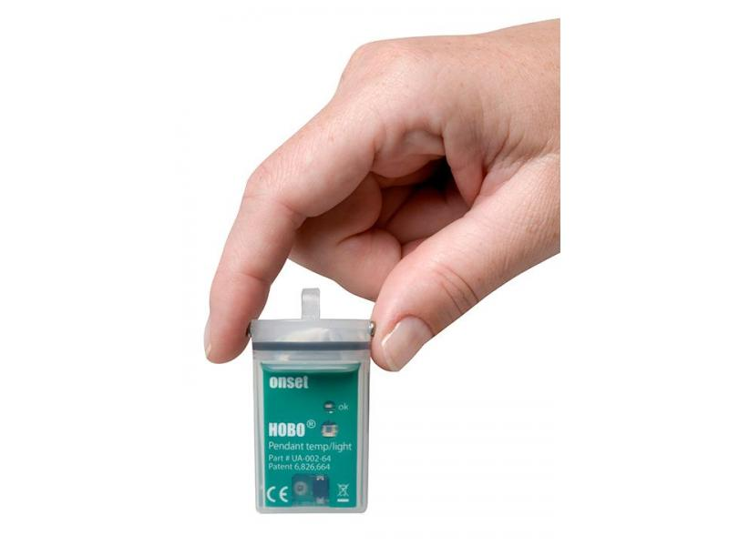

# Riffle -- Design Philosophy

The Riffle -- an open source water monitor -- is a design that has evolved in the last few years through various shapes, feature sets, processors, and applications.  This document is an attempt to capture some of the main ideas and motivations behind the design, and to capture some of its major iterations.

More stuff here.

Let's see how off it will update.  

# Initial Motivation

The initial concept for the Riffle was driven by conversations with Mark Green, a Professor at Plymouth State, about the current technologies used for water monitoring. 

**Proprietary data chain.**  One of the key issues with current water monitoring technologies is that they are typically designed to record data in a proprietary, encrypted format;  the physical hardware almost always requires a special 'dongle' for conveying the data to a PC for analysis and storage; and finally, the software required to decrypt the data is typically expensive, and closed-source, meaning that user modifications or extensions are impossible.  

https://publiclab.org/notes/cfastie/07-20-2014/can-open-source-beat-this
http://www.forestry-suppliers.com/product_pages/Products.asp?mi=84781

- HOBO datalogger used widely; YSI

# Design Goals

After extensive discussions with Mark, Mary Martin, Patrick Herron, and several others in the community, we decided to focus our project around some particular design goals:

**Developing an open hardware alternative.**  We hoped to leverage the world of open source hardware electronics, and see if we could build a basic water monitor device that allowed for easy hardware modification and reprogramming, and easy for people to add new sensors.  

**Open and accessible data formats.** We also planned to design the device so that it could output data in a common data format (CSV), using accessible data storage media (SD cards).  

**Accessible enclosure materials.** We wanted to use accessible, inexpensive materials in the enclsoure design, to make it easy for people to make repairs, custom modifications, using locally-avaiable materials.  

**Establishing a community of users.** Our hope, too, was to establish a community around such a device, so that hardware users could support one another's efforts, help debug code, and share new designs.  

# First Iteration: ARM & PVC

- McHCK project
- Inexpensive
- Fully open source toolchain
- Advanced, low-power ARM chip, built-in USB
- PVC enclosure -- easy waterproofing

https://github.com/bgamari/riffle
https://github.com/bgamari/riffle/blob/fab/hardware/front.png

# Second Iteration: Atmel & Bottle

## enclosure and circuit board shape

Overall:
- PVC was difficult to assemble / source parts for
- Pro mini -- fits in water bottle mouth

Thus:
Main Bottle for circuit board
- Water bottle already clearly water tight
- the bottle -- deployment, 'detrivore' philosophy
- Found that two screws might be enough for conductivity
- Wanted to enable water bottle as ‘easiest option’

Push all sensors to external board, to allow for easy iteration / modification

Cap as 'sensor platform'

Rubber stopper alternative

Still allow for PVC enclsoure

Water bottle also engaging -- riffle label

Show pics of bottle and of separate protoboard

https://publiclab.org/notes/mathew/02-26-2015/sensors-in-soda-bottles
https://publiclab.org/notes/mathew/01-16-2015/sketching-a-waterproof-pop-bottle-sensor-system

- screws 

- rice

- circuit board inside cap

- battery -- found nice one from adafruit

- rubber stopper w/ wires

- label for bottle -- engagement

- audio cables

- research notes / pics for all of these things 

 

 

 

 

 

 

 

<a href="pics/riffle_orig_schematics.pdf">riffle_original_schematics</a>

## IC / placement choices
- Atmel vs ARM
- CH340 -- cheap and easy (but not easy to source)
- DS3231 -- want temp-compensated RTC to line up timestamps
- 2x7 header at end -- to allow water bottle config
- SPI and I2C breakouts at end 
- Hardware interrupts D2 and D3 for any related applications (freq-based measurements like conductivity and depth)
- EEPROM for storing configurations
- Mounting holes for gen purpose mounting
- Show highlights / pics

## Power management choices

- Battery charging circuit
- But requires protective diode to allow for disconnect from USB Serial chip
- So, want to avoid voltage drop
- So, create “gen” battery input, without diode / voltage drop
- RTC alarm functionality 
- Want very low power -- mosfet on external board, mosfet on SD card, mosfet on battery measurement

# Current Design Summary 

the sd card -- data
protoboard -- folks can prototype their own versions of the board
rechargeable battery -- easy for folks to reuse batteries
other battery port -- avoid the diode
eeprom -- store setting
precision RTC -- needed for environmental measurements
mosfets -- to make it low power
battery level , 3.3v

# Aside:  555 and Audio out 

https://publiclab.org/notes/donblair/09-10-2014/water-quality-coqui-voicemails

Lots of notes on Coqui

WebJack

# Other nice projects

Mayfly

