# Motivation / Background

The initial concept for the Riffle came out of conversations with Mark Green, a Professor at Plymouth State, about the current technologies used for water monitoring. 

Water monitors have widespread use in hydrology, pollution monitoring, and many other fields in which water quality and water conditions are of interest.  In the context of pollution monitoring, water monitors are useful for: 

- Identifying and locating point sources of pollution along water bodies like rivers and streams;
- Monitoring the water height and water quality in remote wells;
- Assesing the impact of farming on bays and lakes;
- Many other related applications. 

As a hydrologist, Mark has used various water monitoring technologies in his research for many years.  Mark was interested in the possible use of 'open source hardware' in water monitoring, and identified for us some of the main challenges presented by the current, dominant commercial designs: 

- **Proprietary data format.**  Most commercial systems record data in an encrypted format that can only be decoded by their proprietary software.  

- **Proprietary software suite.** The software required to interact with the hardware is itself proprietary and 'closed'; only the company selling the software is capable of improving the software or fixing bugs, and often the development cycle is slow.

- **Proprietary hardware.** Typical commercial water monitoring hardware requires special hardware dongles' in order to retrieve data from the device.  The monitoring hardware itself is often of high quality, but modifications or the additional of external sensors is not allowed or supported.

Around the same time, Chris Fastie, a forest ecologist familiar with the use of dataloggers in forestry research, wrote up an [assessment] of the qualities that an open source datalogger might usefully have in order to provide a useful alternative to current commercial solutions.

In general, the impression emerged that while solid, thoughtfully engineered monitoring solutions exist, they typically are not designed to allow for modification, innovation, interoperability, or easy data sharing.  

# Project Goals 

As a result, we decided to begin a project to develop an 'open hardware water monitor', useful for some common water monitoring applications.  We sought to make something which would have the following characteristics: 

- **Low power**.  Capable of monitoring at a remote locations for many days -- weeks, at least -- on a battery.

- **Open source hardware.** We hoped to leverage the world of open source hardware electronics, and see if we could build a basic water monitor device that allowed for easy hardware modification and reprogramming, and easy for people to add new sensors. 

- **Open source software.** We aimed to develop simple ways of transferring, visualizing, and analyzing the data collected by these monitors.

- **Open and accessible data formats.** We also planned to design the device so that it could output data in a common data format (CSV), using accessible data storage media (SD cards).  

- **Accessible materials.** The water monitor would require a waterproof enclosure -- our aim to was to construct this enclosure, to the extent that was practical, from materials that could be sourced / replaced locally, in order to reduce costs and enhance accessibility.  The circuit design should use components and a process that would be easy for others to replicate themselves.

- **Encouirage a large community of users.** Our hope, too, was to establish a community around such a device, so that hardware users could support one another's efforts, help debug code, and share new designs.

# Overview of Design Parameters

Below, we describe the main components of the Riffle design, broken up into categories. While some of these categories have inherent overlap -- for example, the circuit board design is intimately related to the choice of enclosure shape -- this division seems to provide a useful way of seaprating out tractable components of the design problem we are attempting to address. 

The categories (elaborated in more detail below) are:

-----------------

#### Enclosure

The container for the water monitoring electronics. 

#### Circuit Board Design

Design considerations around the 'printed circuit board' at the heart of the water monitor.

#### Power / Battery life

Choices made in order to reduce power consumption on the device, in order to enable extended monitoring in the field.

#### Sensors / Modularity

Choices made about the enclosure and circuit board design in order to allow for the main sensing applications of interest.

#### Storage / Data Retrieval

The various mechanism in the Riffle design for data storage and the associated modes of data retrival. 

#### Pinouts / Bus Interfaces

The electronic inputs and outputs afforded by the circuit board design, some of which are associated with specific, common bus protocols used by common sensors.

#### Data Analysis

Considerations for making analysis of the data acquired by open hardware water mointors easier to analyze and share.

#### Development Workflow 

The workflow we envisage around curated designs, code, and data on Public Lab and Github.

#### Similar Projects / Future Directions

A brief listing of projects with similar goals, and possible next steps for Riffle development. 

------------------

# Enclosure

One of the first discussions around the water monitoring design was:  **how will we make the electronics waterproof?**  All of the commercial solutions involve fully custom enclosures, usually made from (initially) expensive metal or plastic molds.  In contrast, we hoped to enable users of our design to source their own enclosure parts locally -- both to reduce cost, and allow for easy modifications / extensions / variants of enclosure designs, associated with novel applications.

The two main enclosure designs that presented themselves used a) **PVC**, and b) **common water bottles**.

### PVC

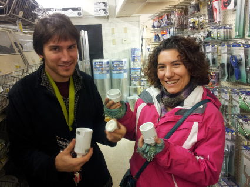

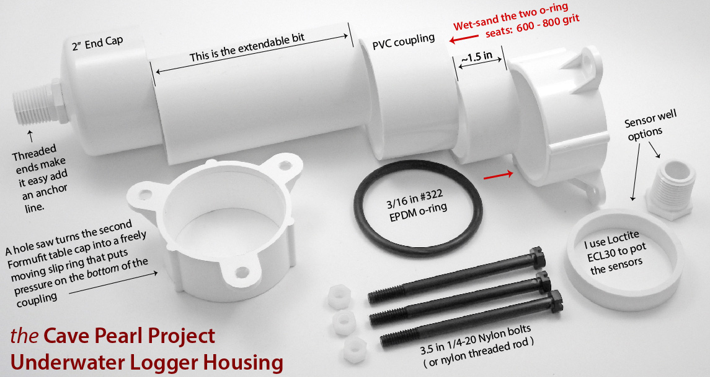

- pros: ubiquitous materials, intended for waterproofing
- cons: actually difficult to make seal and then to reopen
- Cite Edward Mallon design.
- Various enclosure sizes possible
- Screw caps allow possible access
- Actually sealing so that removal is possible is not completely straightforward
- 3D printed cap design was not easy in the end to produce / maintain -- epoxy was difficult to get to seal. f

### Bottle

- Accessible
- More easily waterproofed
- Variations
- A key application -- conductivity and temperature -- seems fairly easy to accomplish

Mathew Lippincott:  the plastic used in the cap is difficult to seal to.  So, use a rubber stopper -- with a champagne wire housing to seal it:

pros: ubiquitous, very cheap
cons: plastic not great for working with -- solution is rubber stopper

https://publiclab.org/notes/mathew/02-26-2015/sensors-in-soda-bottles
https://publiclab.org/notes/mathew/01-16-2015/sketching-a-waterproof-pop-bottle-sensor-system

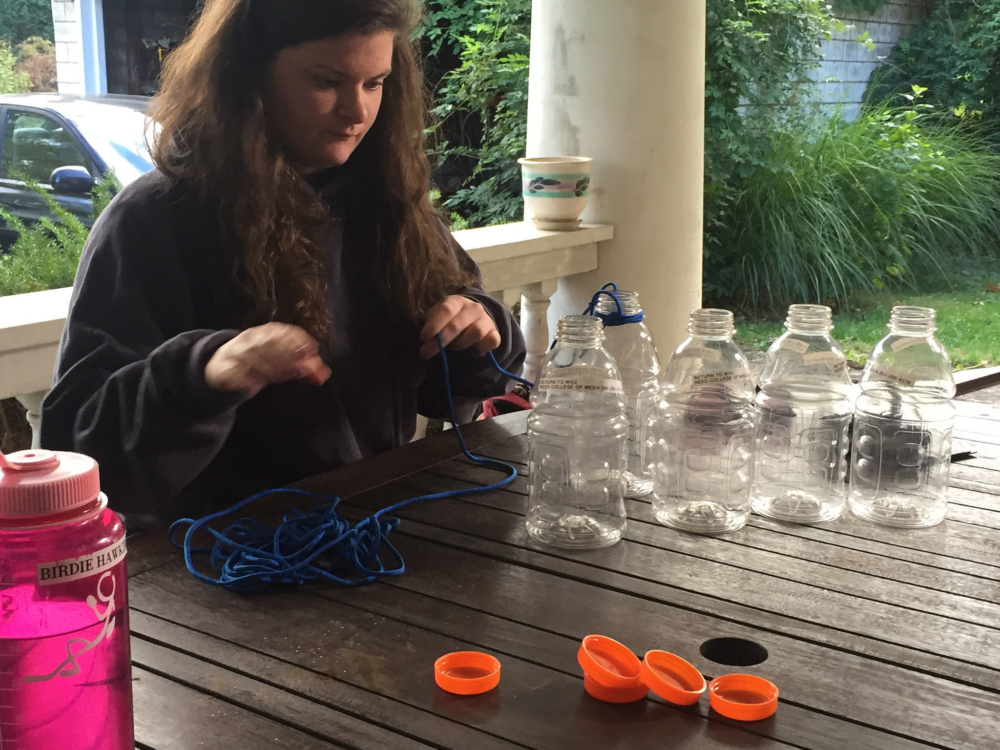
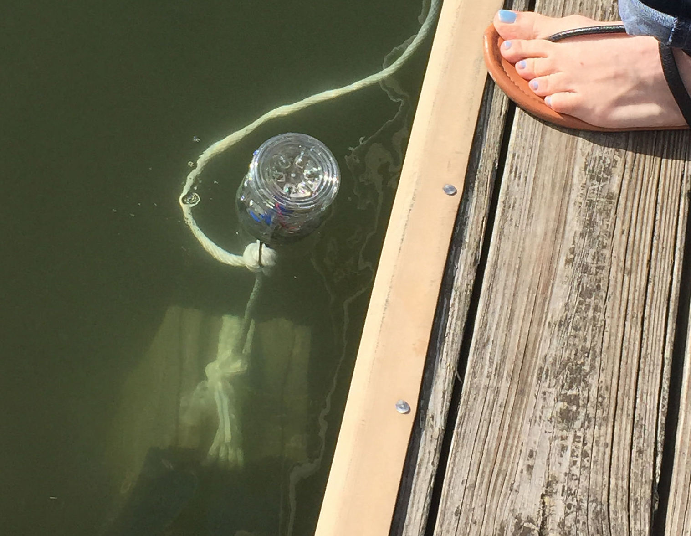

#### Cap

Nice set of designs around modifying the cap.

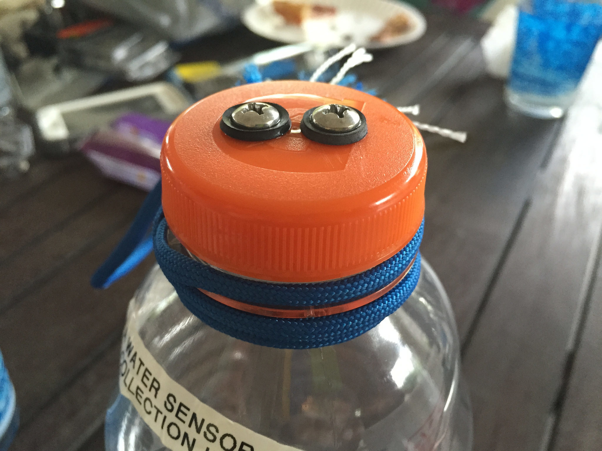

### Other

Chris Fastie focused on a Nalgene-based design.  This allows enough room for a AA battery enclosure and multiple pass-throughs. 

Rebecca -- 3D printed enclosure. 

# Circuit Board Design 

### Initial inspiration:  MCHCK

https://mchck.org/

- ARM
- Same chip as most recent Teensy (ver #?) -- K20 chip.
- MHZ
- Built-in USB.
- Built-in RTC.
- Fully open source toolchain.

Not capable of using the Arduino IDE.

[PIC of RIffle with functional areas marked out]

- Atmel vs ARM
- CH340 -- cheap and easy (but not easy to source)
- DS3231 -- want temp-compensated RTC to line up timestamps
- 2x7 header at end -- to allow water bottle config
- SPI and I2C breakouts at end 
- Hardware interrupts D2 and D3 for any related applications (freq-based measurements like conductivity and depth)
- EEPROM for storing configurations
- Mounting holes for gen purpose mounting
- Show highlights / pics

- https://github.com/bgamari/riffle
- https://github.com/bgamari/riffle/blob/fab/hardware/front.png
- https://mchck.org/

Original Riffle design:

- FTDI-based design.  SD card difficult to solder. 

- Latest 0.1.8 design:

Thin enough to sit inside bottle.
Bottle means that pins and buses need to be oriented at end of board. 
This also works for PVC.

Specs outline in riffle_328 repo [COPY HERE].

# Power / Battery Life

- Battery charging circuit
- But requires protective diode to allow for disconnect from USB Serial chip
- So, want to avoid voltage drop
- So, create “gen” battery input, without diode / voltage drop
- RTC alarm functionality 
- Want very low power -- mosfet on external board, mosfet on SD card, mosfet on battery measurement

- lipo charging
- diode drop
- mosfet on breakout
- mosfets for sd card
- mosfet for battery monitor circuitry

D6 controls power to the SD card circuit:

A common lithum ion battery with a capacity of 2200 mAh is easy to source for $10 (less in bulk):

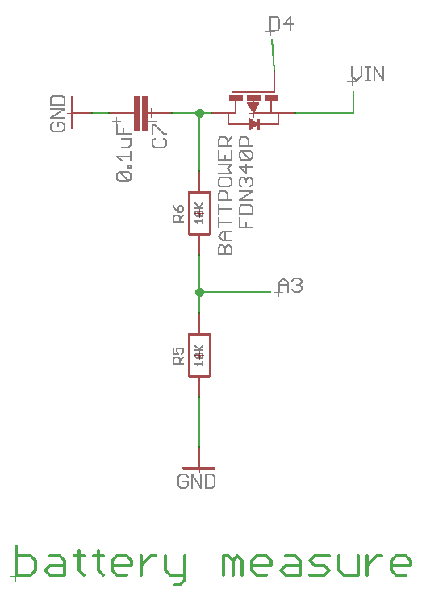
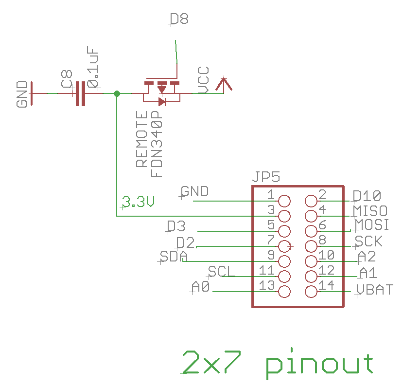

Explantion:  

- UNO 'sleeps' at a high current, which only allows for 2 days of opeartion on a 2000 mAh battery.  
- A Feather, or any datalogger that doesn't allow for shutting off the SD card, is vulnerable to the sleep / wake patterns of the SD card.  This is true of the Riffle if the Mosfet isn't used.
- The Riffle has a Mosfet that allows for turning off the SD card altogether, and Kina Smith figured out the library modification that allows for this.  This extends the battery life.  Further testing is needed to see if this is a reliable way of storing data.  Similar lifetime would likely be found with an EEPROM.
- For reference, a Pro Mini (a minimal circuit, without SD card, RTC, or other auxiliary circuitry) modified for low power (the on-board LED power indicator is removed) can achieve over 1000 days when in sleep mode.  Improvements to the Riffle design might move the power consumption towards this limit. 

https://publiclab.org/notes/kinasmith/06-14-2016/fixed-riffle-sd-card-power-consumption

0.5mA
The Riffle sleeping consumes about 300µA, and the SD card consumes about 200µA.

Arduino Uno is 45 mA

Arduino Pro Mini w/ LED smashed: http://www.home-automation-community.com/arduino-low-power-how-to-run-atmega328p-for-a-year-on-coin-cell-battery/ gets 0.05 mA

Problems with SD cards: https://edwardmallon.wordpress.com/2014/09/22/high-sleep-current-problem-solved/

Feather can't mitigate against bad SD card

# Sensors / Modularity

### Protoboard

[NEED PHOTO OF RIFFLE CONNECTING TO PROTOBOARD]
[ALSO OF COQUI ET AL]

https://github.com/OpenWaterProject/riffle_328-proto

### Instrument design

Reference to the other instrument designs

Listing of the repos

- [Openwaterproject](https://github.com/OpenWaterProject) -- the main organization on github
- [riffle_328](https://github.com/OpenWaterProject/riffle_328) -- hardware designs, instructions and software for getting started with the Riffle_328 datalogger
- [riffle_328-conductivity](https://github.com/OpenWaterProject/riffle_328-conductivity) -- Design considerations around conductivity
- [riffle_328-depth](https://github.com/OpenWaterProject/riffle_328-depth) -- Depth measurement circuit prototype
- [riffle_328-turbidity](https://github.com/OpenWaterProject/riffle_328-depth) -- Turbidity sensor prototype
- [riffle_328-thermistor](https://github.com/OpenWaterProject/riffle_328-thermistor) -- Connecting a thermistor to a Riffle
- [riffle_328-i2c](https://github.com/OpenWaterProject/rriffle_328-depth) -- Connecting i2c sensors to a Riffle
- [riffle_328-one-wire](https://github.com/OpenWaterProject/rriffle_328-one-wire) -- Connecting one-wire sensors to a Riffle

# Storage / Data Retrieval

### eeprom

https://en.wikipedia.org/wiki/EEPROM
http://www.hobbytronics.co.uk/arduino-external-eeprom

- pros / cons
- power consumption

### sdcard
- ed mallon
- power issues

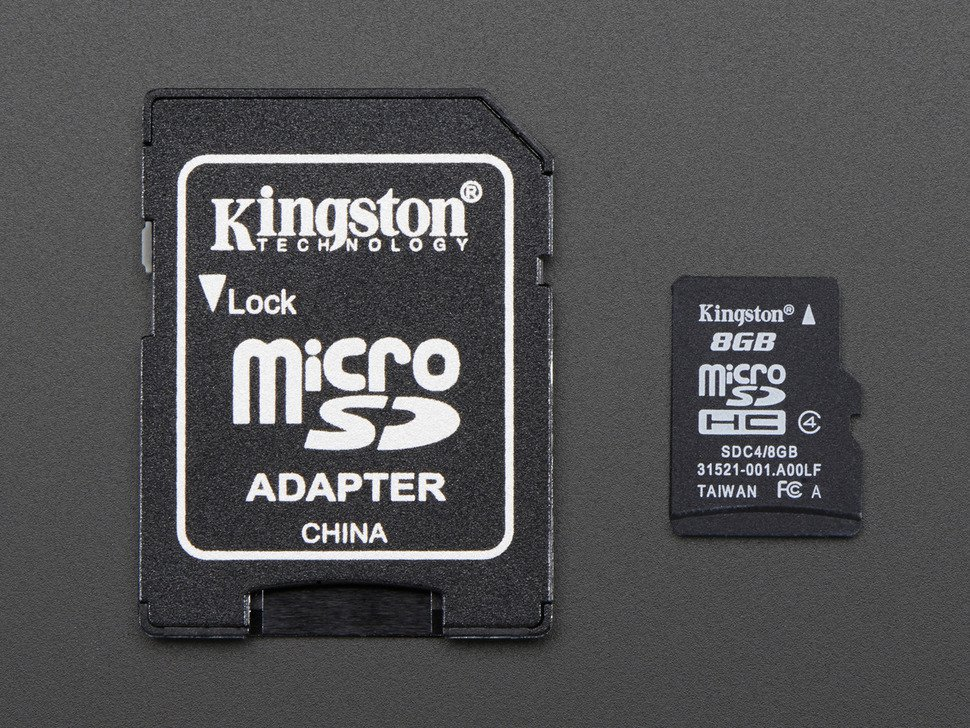

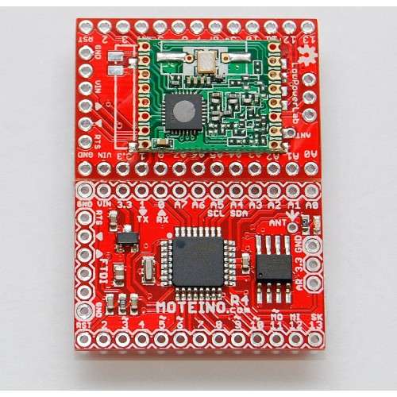

### audio
- webjack
- coqui

https://publiclab.org/notes/donblair/09-10-2014/water-quality-coqui-voicemails

[PIC OF WEBJACK]

### low-power radio (SPI)
- lora 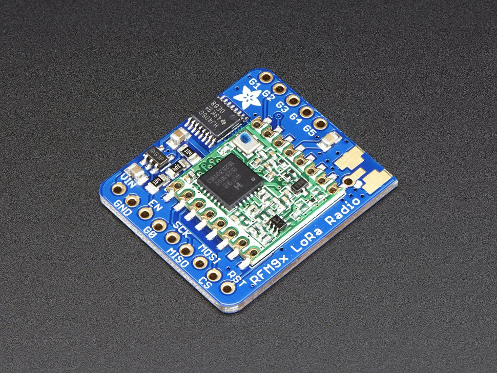
- rfm69
- nordic 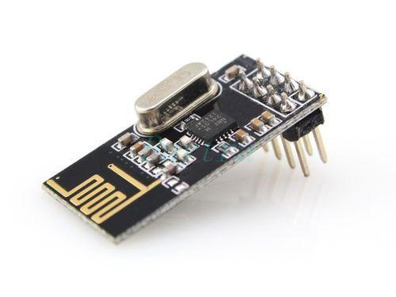

### cell phone
- colombia Surata project, and john keefe WSU
http://johnkeefe.net/monitoring-the-monongahela
 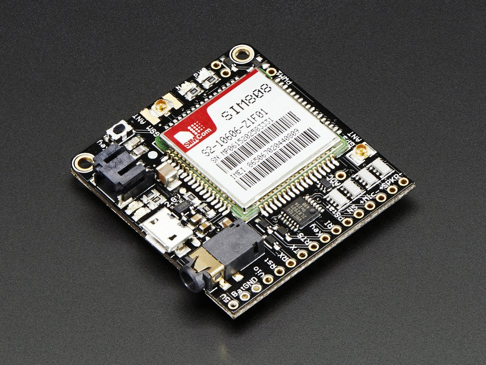

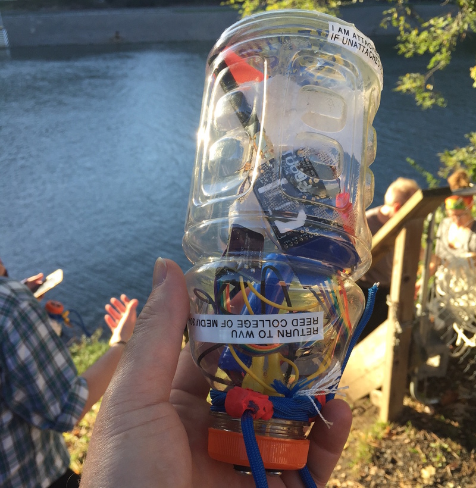

### USB / Wired interface

# Pinouts / Bus Interfaces

[ PIC of READOUT on BACK of BOARD]
[ PIC of EAGLE SCHEMATIC ] 

### analog and digital pins

- A0, A1, A2: 10 bit ADC
- D2, D3: timer / interrupts
- D11, D12, D13: SPI
- SCl, SDA: I2C
- D10: digital pin
- VBAT: the raw battery voltage coming into the board

### i2c

Many sensors now use the i2c interface.  It's a convenient way of sharing several devices on the same bus. 

[ SHOW SOME ADAFRUIT EXAMPLES]

- light
- temp
- pressure

### spi

SPI is a higher-speed interface used by many sensors when speed matters.  For measuring rapidly-changing signals.  Several radio chips use this interface. 

### RX / TX on bottom of board

Broken out on the bottom of the board in case it's useful (for GPS or talking directly to another microcontroller over serial). 

[PIC OF RX/TX ON BACK OF BOARD]

# Data Analysis 

Jupyter 

Google Docs

Explain how most hydrology users have their own graphings software, want to use CSV and R.  

[PICS, links, description] 

# Development Workflow

[ GRAPH ] 

Types of git workflows: https://buddy.works/blog/5-types-of-git-workflows

idea:  ea. of the repos has the hardware and software necessary to move forward
try to make the modules s.t. they can be used on other circuits too -- include some more general code 
use issues in each repo -- *not* preserved -- this is where publiclab wiki structure can be very helpful
write up some description of the ecosystem

- issues

# Similar Projects / Future Directions

#### Mayfly

http://envirodiy.org/introducing-mayfly/

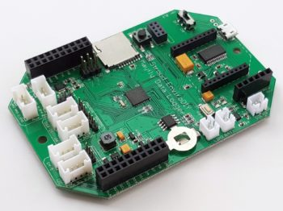

#### Feather

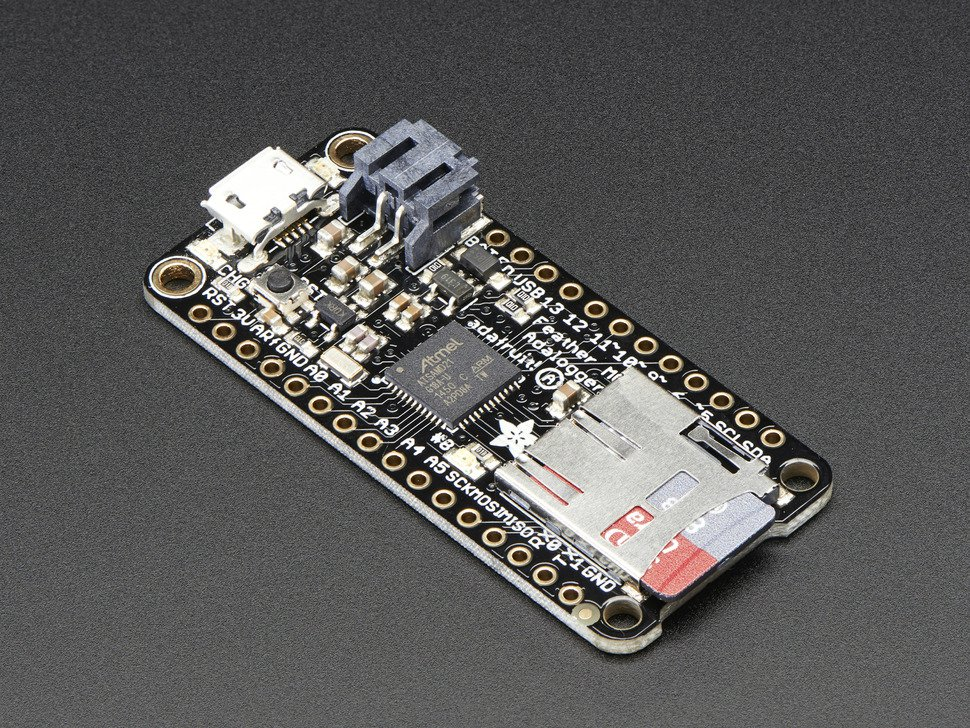

- MO
- 32u4

No mosfet on SD card, no mosfet on battery measurement switch

Specs (copy from site)

Still room for a 328 based datalogger

#### Moteino, and Kina Smith's designs

- Moteino can be used as a datalogger
- Kina Smith's designs are useful

#### OPK and Raspberry Pi

- links to OPK web presence 

