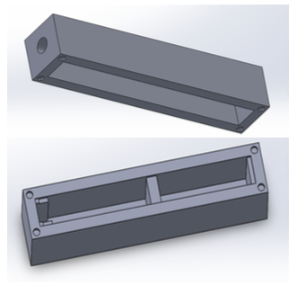

contents of the design document

# Motivation / Applications

A description of the various applications.

- Underwater, in a river.
- Monitoring cisterns and similar water storage enclosures.
- Likely attached underwater to various cinder blocks, and the like.
- Needs to be inexpensive, easy for people to use, try to use locally-available materials for enclosure so that fixes are easy.

Implications for battery life, enclosure, accessibility.

Proprietary dongles 

# Enclosure designs

### PVC

pros: ubiquitous materials, intended for waterproofing
cons: actually difficult to make seal and then to reopen

### Bottle

pros: ubiquitous, very cheap
cons: plastic not great for working with -- solution is rubber stopper

#### Cap

### Other

### Board shape 

Thin enough to sit inside bottle.
Bottle means that pins and buses need to be oriented at end of board. 
This also works for PVC.

# Power / battery life

lipo charging
diode drop
mosfet on breakout
mosfets for sd card
mosfet for battery monitor circuitry

https://publiclab.org/notes/kinasmith/06-14-2016/fixed-riffle-sd-card-power-consumption

0.5mA
The Riffle sleeping consumes about 300µA, and the SD card consumes about 200µA.

Arduino Uno is 45 mA

Arduino Pro Mini w/ LED smashed: http://www.home-automation-community.com/arduino-low-power-how-to-run-atmega328p-for-a-year-on-coin-cell-battery/ gets 0.05 mA

Problems with SD cards: https://edwardmallon.wordpress.com/2014/09/22/high-sleep-current-problem-solved/

Feather can't mitigate against bad SD card

# Sensors / Modularity

### Protoboard

[NEED PHOTO OF RIFFLE CONNECTING TO PROTOBOARD]
[ALSO OF COQUI ET AL]

### Instrument design

Reference to the other instrument designs

# Storage / Data retrieval

### eeprom
### sdcard
### audio 
### USB

# Pins and Bus interfaces

[ PIC of READOUT on BACK of BOARD]
[ PIC of EAGLE SCHEMATIC ] 

### analog and digital pins
### i2c
### spi
### rx / tx on baord itself

# Iteration Workflow on Github

[ GRAPH ] 

idea:  ea. of the repos has the hardware and software necessary to move forward
try to make the modules s.t. they can be used on other circuits too -- include some more general code 
use issues in each repo -- *not* preserved -- this is where publiclab wiki structure can be very helpful
write up some description of the ecosystem

